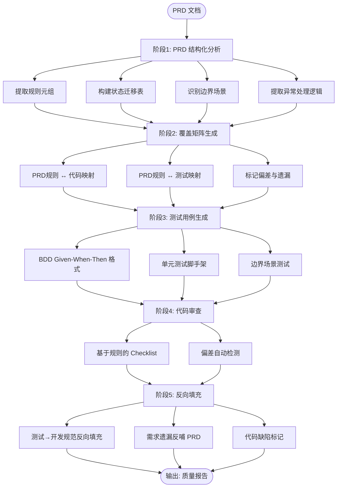
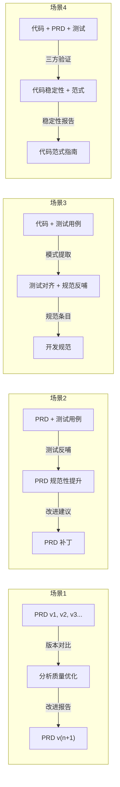

# 闭环工作流

## 基础流水线（单向）

## 4 种场景输入组合

## 场景→子技能映射

|场景|输入|核心子技能|辅助子技能|输出|
|---|---|---|---|---|
|1. PRD版本迭代|PRD v1,v2,...|`prd-quality-improver`|`prd-structured-analysis`|版本 diff + 趋势报告|
|2. PRD+测试|PRD + 测试|`prd-quality-improver`|`coverage-matrix`|PRD 质量评分 + 改进建议|
|3. 代码+测试|代码 + 测试|`standards-backfill-engine`|`test-generation`|规范条目 + 覆盖矩阵更新|
|4. 三方综合|代码+PRD+测试|`standards-backfill-engine`|全部子技能|稳定性评估 + 范式建议|
