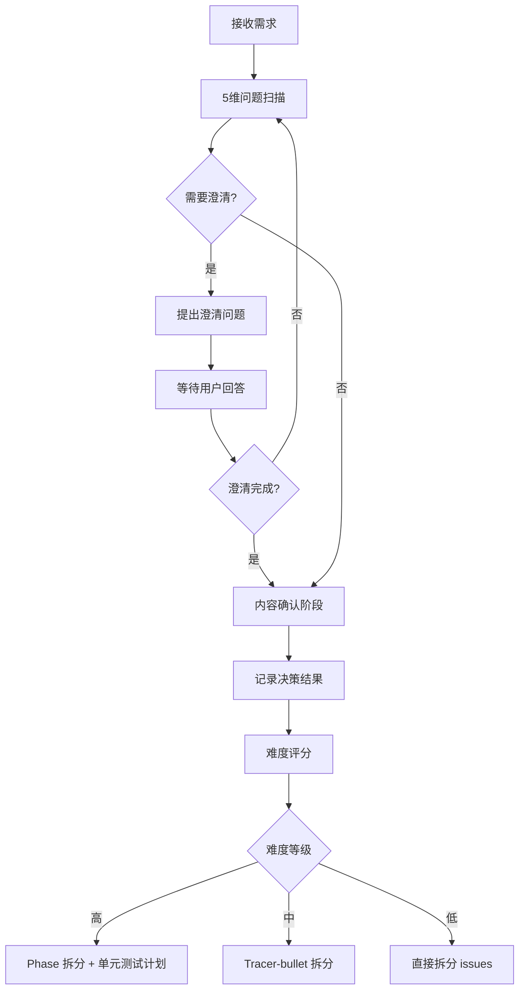
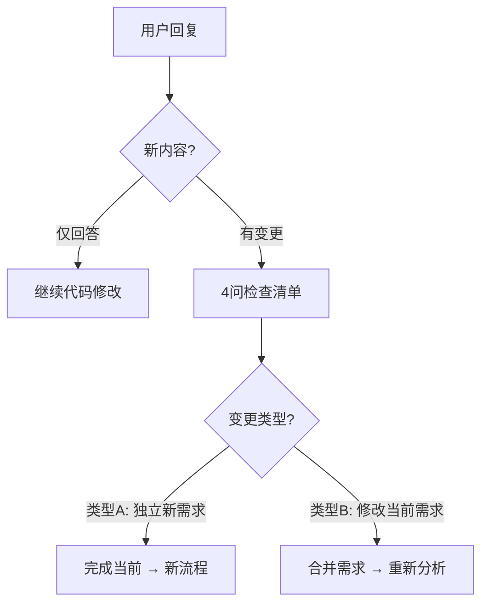

# 工作流程图

## 完整开发工作流

```mermaid
graph TD
    Start([用户请求]) --> Init[/init-workflow-context]
    Init --> Init_Identify[识别功能模块]
    Init_Identify --> Init_Check[检查模块目录结构]
    Init_Check --> Init_Load[按模块加载记忆]
    Init_Load --> Analyze[/analyze-and-split-requirements]
    
    Analyze --> Analyze_Module[确认功能模块]
    Analyze_Module --> Score[开发难度评分]
    Score --> Branch{难度等级?}
    
    Branch -- 高 --> High_Module[确定模块路径 modules/[模块]/]
    High_Module --> High_TDD[制定 TDD + 单元测试计划]
    High_TDD --> High_Split[拆分为多个子需求]
    High_Split --> High_Doc[创建需求文档 + 测试计划]
    High_Doc --> High_Confirm[用户确认拆分结果]
    High_Confirm --> High_Approve{用户批准?}
    High_Approve -- 否 --> High_Adjust[调整拆分方案]
    High_Adjust --> High_Split
    High_Approve -- 是 --> High_Save[保存到 modules/[模块]/requirements/high/]
    High_Save --> High_Issues[创建 issues 到 modules/[模块]/issues/high/]
    
    Branch -- 中 --> Medium_Module[确定模块路径 modules/[模块]/]
    Medium_Module --> Medium_TDD[制定 TDD + 集成测试计划]
    Medium_TDD --> Medium_Tracer[使用 tracer-bullet 拆分]
    Medium_Tracer --> Medium_Save[保存到 modules/[模块]/]
    
    Branch -- 低 --> Low_Module[确定模块路径 modules/[模块]/]
    Low_Module --> Low_TDD[制定 TDD + 功能验证计划]
    Low_TDD --> Low_Tracer[使用 tracer-bullet 拆分 issues]
    Low_Tracer --> Low_Save[保存到 modules/[模块]/issues/low/]
    
    High_Issues --> Code[/coding-principles]
    Medium_Save --> Code
    Low_Save --> Code
    
    Code --> Code_Rule1[规则1: 编码前先思考]
    Code_Rule1 --> Code_Rule2[规则2: 简洁优先]
    Code_Rule2 --> Code_Rule3[规则3: 外科手术式修改]
    Code_Rule3 --> Code_Rule4[规则4: 目标驱动执行]
    Code_Rule4 --> Code_TDD[执行 TDD 循环]
    
    Code_TDD --> TDD_Red[RED: 写失败测试]
    TDD_Red --> TDD_Green[GREEN: 写最少代码]
    TDD_Green --> TDD_Refactor[REFACTOR: 重构优化]
    TDD_Refactor --> TDD_Verify{测试通过?}
    TDD_Verify -- 否 --> TDD_Red
    TDD_Verify -- 是 --> Final[/finalize-workflow-context]
    
    Final --> Final_Module[识别功能模块]
    Final_Module --> Final_Update[按模块分类更新]
    Final_Update --> Final_Issues[更新模块内 issues 状态]
    Final_Issues --> Final_Requirements[更新模块内需求文档]
    Final_Requirements --> Final_ModuleMemory[更新模块记忆]
    Final_ModuleMemory --> Final_ProjectMemory[更新项目记忆]
    Final_ProjectMemory --> Final_Compress[按模块分类压缩整理]
    Final_Compress --> Final_Archive[归档到模块内对应难度目录]
    Final_Archive --> Complete([任务完成])
```

## 需求澄清流程（5 维扫描）



## 需求变更检测流程


