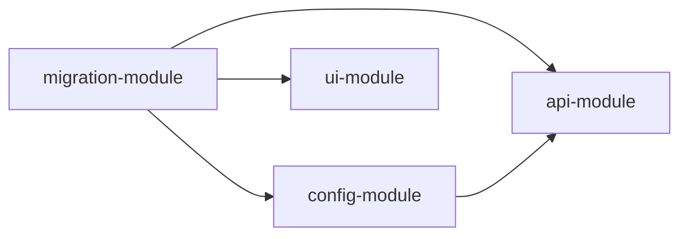

# 分析需求并拆分（需求开发场景）

**接收新需求时：澄清需求、识别功能模块、确认内容、记录决策、评估难度、拆分可执行的 issues，确保 TDD 开发流程。**

## 触发时机

- ✅ 用户提出新的开发需求："帮我实现 X"、"需要做 Y 功能"
- ✅ 用户提出需求描述文档（PRD、设计文档、迁移计划等）
- ✅ 用户要求处理某个开发任务："开发某个模块"、"合并代码"
- ✅ 用户提出涉及代码变更的任务

## 核心流程图

```mermaid
graph TD
    Start([接收新需求]) --> Load[/init-workflow-context]
    Load --> Load_Module[加载模块记忆]
    Load_Module --> Identify[识别功能模块]
    Identify --> Clarify[需求澄清]
    Clarify --> Clarify_5D[5维问题扫描]
    Clarify_5D --> Clarify_Answer{需要澄清?}
    Clarify_Answer -- 是 --> Clarify_Q[提出澄清问题]
    Clarify_Q --> Clarify_Wait[等待用户回答]
    Clarify_Wait --> Clarify_Check{澄清完成?}
    Clarify_Check -- 否 --> Clarify_5D
    Clarify_Check -- 是 --> ContentConfirm[内容确认阶段]
    Clarify_Answer -- 否 --> ContentConfirm

    ContentConfirm --> Content_Check{有详细文档?}
    Content_Check -- 是 --> Content_Load[加载现有清单/文档]
    Content_Check -- 否 --> Content_Create[创建内容清单]
    Content_Load --> Content_Classify[分类确认内容]
    Content_Create --> Content_Classify
    Content_Classify --> Content_Questions[提出关键确认问题]
    Content_Questions --> Content_Wait[等待用户确认]
    Content_Wait --> Content_Approve{用户确认?}
    Content_Approve -- 否 --> Content_Adjust[调整内容清单]
    Content_Adjust --> Content_Questions
    Content_Approve -- 是 --> Score[开发难度评分]

    Score --> Branch{难度等级?}

    Branch -- 高 --> High_Module[确定功能模块目录]
    High_Module --> High_TDD[制定 TDD + 单元测试计划]
    High_TDD --> High_Split[拆分为多个子需求]
    High_Split --> High_Doc[创建需求文档 + 测试计划]
    High_Doc --> High_Confirm[用户确认拆分结果]
    High_Confirm --> High_Approve{用户批准?}
    High_Approve -- 否 --> High_Adjust[调整拆分方案]
    High_Adjust --> High_Split
    High_Approve -- 是 --> High_Save[保存到 modules/[模块]/requirements/high/]
    High_Save --> High_Issues[创建 issues 到 modules/[模块]/issues/high/]

    Branch -- 中 --> Medium_Module[确定功能模块目录]
    Medium_Module --> Medium_TDD[制定 TDD + 集成测试计划]
    Medium_TDD --> Medium_Tracer[使用 tracer-bullet 拆分]
    Medium_Tracer --> Medium_Save[保存到 modules/[模块]/]

    Branch -- 低 --> Low_Module[确定功能模块目录]
    Low_Module --> Low_TDD[制定 TDD + 功能验证计划]
    Low_TDD --> Low_Tracer[使用 tracer-bullet 拆分 issues]
    Low_Tracer --> Low_Save[保存到 modules/[模块]/issues/low/]

    High_Issues --> End([准备开始 TDD 实现])
    Medium_Save --> End
    Low_Save --> End
```

---

## 需求澄清阶段（新增）

### 5维问题扫描框架

**在分析需求前，先进行 5 维度问题扫描，识别核心矛盾：**

| 维度 | 扫描问题 | 检查点 | 如果存在矛盾 → |
|------|---------|--------|--------------|
| **Who** | 谁是用户？谁是开发者？ | 用户角色、权限、开发者角色 | 澄清角色和权限 |
| **What** | 需要做什么？要实现什么功能？ | 功能描述、输入输出、边界条件 | 澄清功能范围 |
| **Where** | 在哪里实现？涉及哪些模块？ | 模块位置、文件路径、架构层次 | 澄清模块归属 |
| **When** | 何时使用？何时完成？ | 使用时机、依赖关系、完成时间 | 澄清时机和优先级 |
| **Why** | 为什么需要？解决什么问题？ | 业务目标、用户痛点、技术目标 | 澄清业务价值 |

### 澄清问题输出模板

```markdown
## 🔍 需求澄清（5维问题扫描）

### 原需求描述

[用户提供的原始需求]

### 5维扫描结果

| 维度 | 扫描发现 | 是否清晰 | 需澄清问题 |
|-----|---------|---------|-----------|
| **Who** | [发现] | ✅清晰 / ❌模糊 | [具体问题] |
| **What** | [发现] | ✅清晰 / ❌模糊 | [具体问题] |
| **Where** | [发现] | ✅清晰 / ❌模糊 | [具体问题] |
| **When** | [发现] | ✅清晰 / ❌模糊 | [具体问题] |
| **Why** | [发现] | ✅清晰 / ❌模糊 | [具体问题] |

### 需要澄清的问题

**必须澄清的问题（影响实现）：**

1. ❓ **[维度-问题]**：[具体问题描述]
   - 假设 A：[假设1]
   - 假设 B：[假设2]
   - **请确认：** [具体选项]

**可选澄清的问题（优化实现）：**

2. ❓ **[维度-问题]**：[具体问题描述]

### 请回答上述问题，以便准确拆分任务
```

---

## 内容确认阶段（新增）

### 为什么需要内容确认阶段？

**在开发难度评分和Phase拆分之前，必须先确认具体的实施内容：**

- ✅ 避免基于错误假设拆分任务
- ✅ 确保拆分方案符合实际需求
- ✅ 提高用户参与度，减少后期调整
- ✅ 识别关键决策点，明确合并策略

### 内容确认触发条件

**以下场景必须进行内容确认：**

- ✅ 涉及多个模块整合的任务（迁移合并、架构重构）
- ✅ 已有详细文档（PRD、迁移计划、合并清单等）
- ✅ 需要在多个版本/分支之间合并代码
- ✅ 高难度任务（≥16分）在拆分前必须确认内容

### 内容确认流程

#### 步骤1：检查是否有详细文档

**检查是否存在以下文档：**

- MIGRATION-PLAN.md（迁移计划）
- MIGRATION-CHECKLIST.csv（合并清单）
- PRD.md（产品需求文档）
- 设计文档
- 技术方案文档

**如果有：** 直接加载并分类确认
**如果没有：** 创建内容清单，列出所有涉及的文件/目录

#### 步骤2：分类确认内容

**将内容按以下分类组织：**

| 分类 | 说明 | 确认重点 |
|-----|------|---------|
| **配置文件** | package.json、tsconfig.json等 | 合并方向、优先级、冲突处理策略 |
| **基础架构** | hooks、dui组件库等 | 是否引入、兼容性评估 |
| **新功能模块** | combination-reform等 | 是否引入、业务价值评估 |
| **现有功能保留** | bondswarn、information等 | 是否必须保留、用户依赖度 |
| **资源文件** | 图标、样式等 | 是否保留、路径变化影响 |
| **工具文件** | utils、API等 | 合并策略、迁移方案 |
| **需要比对的文件** | 两版本都有但内容不同 | 详细比对方法、合并策略 |

#### 步骤3：提出关键确认问题

**针对每个分类提出关键问题，确保用户明确决策：**

**问题类型：**

1. **必须回答的问题**（影响实施方案）
   - 核心功能是否必须保留？
   - 新功能是否必须引入？
   - 合并策略是什么？

2. **可选回答的问题**（优化实施效果）
   - 配置冲突如何处理？
   - 工具文件如何迁移？
   - 资源文件是否保留？

#### 步骤4：等待用户确认

**用户提供确认后，根据确认结果调整Phase拆分方案。**

#### 步骤5：记录决策结果（新增）

**参考 `/to-prd` skill 的决策记录方式，将所有关键决策记录到 memory 中：**

**决策记录原则：**

- ✅ 记录决策内容（选择了什么）
- ✅ 记录决策原因（为什么选择这个）
- ✅ 记录决策影响（这个决策的影响范围）
- ✅ 记录建议方案（AI的建议和理由）
- ✅ 按功能模块分类保存决策记录

**决策记录保存位置：**

- 主要模块决策：`modules/[主要模块]/decisions.md`
- 关联模块决策：`modules/[关联模块]/decisions.md`
- 项目级决策：`memory/project/decisions.md`

**决策记录格式：**

```markdown
## Decision Records

### [决策ID] - [决策标题]

**决策日期：** YYYY-MM-DD
**决策模块：** [模块名]-module
**决策类型：** [功能保留 / 功能引入 / 配置合并 / 工具迁移]

#### 决策背景

[为什么要做这个决策？问题的背景是什么？]

#### 建议方案

**AI建议：** [建议方案]
**建议理由：** [为什么建议这个方案]

#### 决策结果

**最终决策：** [用户选择的方案]
**决策原因：** [用户为什么选择这个方案]

#### 决策影响

**影响范围：**
- [影响的模块1]
- [影响的模块2]

**影响内容：**
- [具体影响的内容]

#### 相关文件

- [涉及的文件1]
- [涉及的文件2]
```

### 内容确认输出模板

```markdown
## 🔍 内容确认阶段

### 已有文档

- ✅ MIGRATION-PLAN.md（详细合并计划）
- ✅ MIGRATION-CHECKLIST.csv（合并清单）

### 内容分类确认

#### 1️⃣ 配置文件合并

| 文件路径 | 合并方向 | 状态 | 需确认问题 |
|---------|---------|------|-----------|
| package.json | 标准版←SaaS版 | 待执行 | ❓ 是否添加volta配置？ |
| tsconfig.json | 双向合并 | 待执行 | ❓ 如何合并路径别名？ |

**请确认：**
- ✅ 全部同意按SaaS版配置更新
- 🔄 部分调整（请说明）

#### 2️⃣ 基础架构引入

| 目录/文件 | 合并方向 | 状态 | 需确认问题 |
|---------|---------|------|-----------|
| src/components/hooks/ | 标准版←SaaS版 | 待执行 | ✅ 必须引入 |

**请确认：**
- ✅ 全部引入
- 🔄 部分引入

#### 3️⃣ 新功能模块引入

| 目录/文件 | 合并方向 | 状态 | 需确认问题 |
|---------|---------|------|-----------|
| src/pages/combination-reform/ | 标准版←SaaS版 | 待执行 | ❓ 是否必须引入？ |

**请确认：**
- ✅ 必须引入
- 🔄 可以评估

#### 4️⃣ 现有功能保留

| 目录/文件 | 合并方向 | 状态 | 需确认问题 |
|---------|---------|------|-----------|
| src/pages/bondswarn/ | 必须保留 | 待确认 | ❓ 是否必须保留？ |

**请确认：**
- ✅ 必须保留
- 🔄 可以评估

### 🎯 关键确认问题（必须回答）

#### Q1: 核心功能保留策略

**债券预警模块和信息中心模块是否必须保留？**

- ✅ **必须保留** - 核心业务功能，用户依赖
- 🔄 可以评估

**我的建议：** ✅ 必须保留

#### Q2: 新功能引入策略

**组合改革模块是否必须引入？**

- ✅ **必须引入** - SaaS版核心新功能
- 🔄 可以评估

**我的建议：** ✅ 必须引入

#### Q3: 配置文件合并策略

**package.json如何合并？**

- ✅ 优先SaaS版配置
- 🔄 手动合并
- 📖 需要详细比对

**我的建议：** 🔄 手动合并

#### Q4: 工具文件处理策略

**format.js与format.ts如何处理？**

- ✅ 合并为一个文件
- 🔄 共存
- ❌ 删除format.js

**我的建议：** 🔄 共存

### 📝 请回答确认问题

请按以下格式回答：

```markdown
## 合并内容确认

### Q1: 核心功能保留
- 债券预警模块：[必须保留 / 可以评估]
- 信息中心模块：[必须保留 / 可以评估]

### Q2: 新功能引入
- 组合改革模块：[必须引入 / 可以评估]

### Q3: 配置文件合并
- package.json：[优先SaaS版 / 手动合并]

### Q4: 工具文件处理
- format.js与format.ts：[合并 / 共存]

### 其他补充说明
[如有其他需要调整的内容，请在此说明]
```

---

**确认内容后，我会根据你的回答调整Phase拆分方案，并记录所有决策！**
```

---

### 决策记录示例（迁移合并任务）

**用户回答确认问题后，系统会自动生成决策记录：**

#### 示例决策记录1：核心功能保留

```markdown
## Decision Records

### DEC-001 - 债券预警模块保留策略

**决策日期：** 2026-07-07
**决策模块：** migration-module
**决策类型：** 功能保留

#### 决策背景

标准版组合监控模块迁移到SaaS版本时，需要决定债券预警模块（bondswarn）是否保留。债券预警是标准版的核心业务功能，用户依赖度高。

#### 建议方案

**AI建议：** 必须保留
**建议理由：**
- 债券预警是标准版核心业务功能
- 用户依赖度高，不能丢失
- MIGRATION-PLAN.md标记为高优先级保留项

#### 决策结果

**最终决策：** ✅ 必须保留
**决策原因：** 用户确认这是核心业务功能，必须保留

#### 决策影响

**影响范围：**
- migration-module（迁移合并模块）
- api-module（API模块）
- ui-module（UI组件模块）

**影响内容：**
- 需要确保债券预警功能在合并后正常运行
- 需要保留债券预警相关API（bondswarn相关）
- 需要保留债券预警相关组件和页面

#### 相关文件

- src/pages/bondswarn/（债券预警页面目录）
- src/components/bondwarn/（债券预警组件目录）
- src/api/api.js（债券预警API定义）

---

### DEC-002 - 组合改革模块引入策略

**决策日期：** 2026-07-07
**决策模块：** migration-module
**决策类型：** 功能引入

#### 决策背景

标准版需要引入SaaS版的组合改革模块（combination-reform），这是SaaS版的核心新功能，业务价值高。

#### 建议方案

**AI建议：** 必须引入
**建议理由：**
- 组合改革是SaaS版核心新功能
- MIGRATION-PLAN.md标记为高优先级引入项
- 业务价值高，用户需要

#### 决策结果

**最终决策：** ✅ 必须引入
**决策原因：** 用户确认这是SaaS版核心新功能，需要引入

#### 决策影响

**影响范围：**
- migration-module（迁移合并模块）
- ui-module（UI组件模块）
- api-module（API模块）

**影响内容：**
- 需要引入组合改革模块完整目录
- 需要添加组合改革相关路由配置
- 需要添加组合改革相关API接口

#### 相关文件

- src/pages/combination-reform/（组合改革页面目录）
- app.json（路由配置）
- src/api/api.js（API定义）

---

### DEC-003 - package.json合并策略

**决策日期：** 2026-07-07
**决策模块：** config-module
**决策类型：** 配置合并

#### 决策背景

标准版和SaaS版的package.json配置存在差异，需要决定合并策略。主要差异包括volta配置、E2E测试脚本、ESLint扩展等。

#### 建议方案

**AI建议：** 手动合并
**建议理由：**
- 保留prettier ESLint扩展（避免大规模代码风格调整）
- 添加volta配置（统一Node和PNPM版本）
- 添加E2E测试脚本（引入测试框架）

#### 决策结果

**最终决策：** 🔄 手动合并
**决策原因：**
- 用户希望保留prettier ESLint扩展
- 需要添加volta和E2E测试配置
- 避免直接替换导致的代码风格冲突

#### 决策影响

**影响范围：**
- config-module（配置模块）
- test-module（测试模块）
- 全项目（代码风格）

**影响内容：**
- package.json需要手动合并多个配置项
- 添加volta配置：Node 18.19.0, PNPM 6.35.1
- 添加E2E测试脚本：test:e2e、test:e2e:ui等
- 保留prettier ESLint扩展：避免大规模调整

#### 相关文件

- package.json（项目配置文件）

---

### DEC-004 - format文件处理策略

**决策日期：** 2026-07-07
**决策模块：** migration-module
**决策类型：** 工具迁移

#### 决策背景

标准版有format.js，SaaS版有format.ts，需要决定如何处理这两个文件。

#### 建议方案

**AI建议：** 共存
**建议理由：**
- 避免大规模重构
- 逐步迁移，两个文件可以相互补充
- 降低迁移风险

#### 决策结果

**最终决策：** 🔄 共存
**决策原因：**
- 用户选择共存方案
- 避免一次性迁移导致的兼容性问题
- 可以逐步迁移到TS版本

#### 决策影响

**影响范围：**
- migration-module（迁移合并模块）

**影响内容：**
- format.js和format.ts将共存
- 不同场景可以使用不同版本
- 后续可以逐步迁移到TS版本

#### 相关文件

- src/utils/format.js（JS格式化工具）
- src/utils/format.ts（TS格式化工具）
```

---

### 决策记录保存路径

**决策记录按模块分类保存：**

```
memory/
├── modules/
│   ├── migration-module/
│   │   ├── decisions.md          # 迁移合并相关决策
│   │   ├── issues/
│   │   └── requirements/
│   ├── config-module/
│   │   ├── decisions.md          # 配置相关决策
│   │   ├── issues/
│   │   └── requirements/
│   ├── ui-module/
│   │   ├── decisions.md          # UI组件相关决策
│   │   ├── issues/
│   │   └── requirements/
│   ├── api-module/
│   │   ├── decisions.md          # API相关决策
│   │   ├── issues/
│   │   └── requirements/
│   └── test-module/
│       ├── decisions.md          # 测试相关决策
│       ├── issues/
│       └── requirements/
└── project/
    ├── decisions.md              # 项目级决策（跨模块）
    ├── conventions.md
    └── learnings.md
```

---

### 决策记录使用流程

**用户回答确认问题后，系统会：**

1. **自动生成决策记录** - 根据用户回答生成决策记录
2. **按模块分类保存** - 保存到对应模块的 decisions.md
3. **创建决策索引** - 更新模块 index.md 包含决策列表
4. **更新Phase拆分** - 根据决策结果调整Phase拆分方案

**决策记录的好处：**

- ✅ 记录决策历史，便于追溯
- ✅ 记录决策原因，便于理解
- ✅ 记录决策影响，便于评估
- ✅ 按模块分类，便于查找
- ✅ 支持后续调整，便于维护

---

## 功能模块识别（增强版）

### 模块关键词映射表（扩展）

| 关键词/文件/场景 | 功能模块 | 模块目录 | 识别优先级 |
|----------------|---------|---------|----------|
| user, 用户, 登录, 注册, 权限, auth | user-module | `modules/user-module/` | 高 |
| import, 导入, 批量, upload, 批量处理 | import-module | `modules/import-module/` | 高 |
| validation, 验证, 校验, 检查, validate | validation-module | `modules/validation-module/` | 中 |
| config, 配置, setting, 环境变量, env | config-module | `modules/config-module/` | 中 |
| api, 接口, 路由, endpoint, controller | api-module | `modules/api-module/` | 高 |
| db, 数据库, 存储, database, storage, migration | db-module | `modules/db-module/` | 高 |
| ui, 界面, 组件, component, view, page | ui-module | `modules/ui-module/` | 中 |
| test, 测试, test-case, spec, e2e | test-module | `modules/test-module/` | 低 |
| **migration, 合并, 迁移, merge, 整合** | **migration-module** | **`modules/migration-module/`** | **高** |
| **integration, 集成, combine, 整合** | **integration-module** | **`modules/integration-module/`** | **高** |

### 模块识别输出（增强版）

```markdown
## 🔍 功能模块识别

**任务关键词：** [从任务描述提取的关键词]
**任务类型：** [新功能开发 / 功能增强 / 代码重构 / 迁移合并 / Bug修复]

| 关键词 | 模块目录 | 存在状态 | Issues 数量 | 优先级 |
|-------|---------|---------|------------|--------|
| migration | migration-module | 已存在/需创建 | low:0, medium:0, high:2 | 高 |
| config | config-module | 已存在 | low:1, medium:0 | 中 |
| ui | ui-module | 已存在 | low:2 | 中 |

**主要模块：** migration-module
**关联模块：** config-module, ui-module, api-module
**任务复杂度预估：** 高（涉及多个模块整合）

### 模块依赖关系


```

---

## 开发难度评分框架（针对需求开发优化）

### 5维度评分（优化版）

| 维度 | 评分标准 | 分值范围 | 需求开发特例 |
|-----|---------|---------|-------------|
| **文件数量** | 1-2个(1分) / 3-5个(3分) / 6+个(5分) | 1-5 | 配置文件合并加1分 |
| **依赖复杂度** | 独立模块(1分) / 2-3模块交互(3分) / 4+模块或核心架构(5分) | 1-5 | 多模块合并加2分 |
| **需求明确度** | 非常清晰(1分) / 2-3模糊点(3分) / 4+模糊点(5分) | 1-5 | 有PRD文档减1分 |
| **技术风险** | 常规实现(1分) / 新技术或重构(3分) / 架构变更(5分) | 1-5 | 涉及架构重构加3分 |
| **业务复杂度** | 简单增删改(1分) / 业务规则变更(3分) / 核心流程(5分) | 1-5 | 核心业务功能加2分 |

### 需求开发特殊评分规则

**额外加分项：**

- 涉及多个版本/分支合并：+2分
- 需要保留现有功能：+1分
- 需要引入新架构：+3分
- 需要兼容性测试：+2分
- 有详细迁移计划文档：-1分（有文档降低难度）

**总分计算：** 基础分 + 额外加分

### 难度等级划分（优化版）

| 总分 | 难度等级 | 处理策略 | 测试要求 | Memory路径 |
|-----|---------|---------|---------|-----------|
| **≤10分** | 低难度 | 直接拆分 issues，无需详细确认 | TDD + 功能验证 | `modules/[模块]/issues/low/` |
| **11-15分** | 中难度 | 澄清问题，确认后拆分 issues | TDD + 集成测试 | `modules/[模块]/issues/medium/` |
| **≥16分** | 高难度 | 拆分子需求，创建需求文档，用户确认 | **必须单元测试** + TDD + 集成测试 | `modules/[模块]/requirements/high/` |

---

## Memory 存储路径（按功能模块分类）

**核心原则：先按功能模块分类，再按难度子分类**

### 需求开发存储路径示例

**迁移合并任务（migration-module）：**

```
modules/migration-module/
├── issues/
│   ├── high/
│   │   ├── issue-001.md  # 高难度issue（必须单元测试）
│   │   └── issue-002.md
│   ├── medium/
│   │   └── issue-003.md  # 中难度issue（TDD+集成测试）
│   └── low/
│   │   └── issue-004.md  # 低难度issue（TDD+功能验证）
├── requirements/
│   ├── high/
│   │   ├── req-001.md    # 高难度需求文档
│   │   └── tests/
│   │       └── test-plan-001.md  # 单元测试计划
│   ├── medium/
│   │   └── req-002.md
│   └── decisions.md      # 模块级决策记录
└── index.md              # 模块索引
```

---

## TDD 开发原则（针对需求开发）

### TDD 核心理念

> **Tests should verify behavior through public interfaces, not implementation details. Code can change entirely; tests shouldn't.**

### TDD 工作流程

```
RED → GREEN → REFACTOR → 循环
```

### Tracer-Bullet Vertical Slices（需求开发特化）

**需求开发的纵向切片策略：**

```
需求拆分 → 端到端功能切片 → 每个切片独立可测试

示例（迁移合并任务）：
切片1：配置文件合并 → test配置 → 合并配置 → verify配置
切片2：基础架构引入 → test架构 → 引入架构 → verify架构
切片3：功能模块合并 → test功能 → 合并功能 → verify功能
切片4：兼容性测试 → test兼容 → verify兼容 → 验证通过
```

---

## 高难度处理路径（需求开发场景）

### 步骤1：需求澄清（5维问题扫描）

**必须澄清的核心矛盾：**

```markdown
## 🔍 需求澄清（迁移合并任务）

### 5维扫描结果

| 维度 | 扫描发现 | 需澄清问题 |
|-----|---------|-----------|
| **Who** | 标准版用户、SaaS版用户 | 权限是否有差异？ |
| **What** | 合并组合监控模块 | 哪些功能必须保留？哪些必须引入？ |
| **Where** | standard-combination → app-combination | 合并到哪个版本？保留哪个版本？ |
| **When** | 涉及多个Phase | 合并顺序是什么？优先级如何？ |
| **Why** | 升级标准版到最新架构 | 业务目标是什么？用户痛点是什么？ |

### 需要澄清的问题

**必须回答：**

1. ❓ **What-功能范围**：债券预警模块是否必须保留？
   - 假设 A：必须保留（核心业务功能）
   - 假设 B：可以评估后决定
   - **请确认：** 哪个假设正确？

2. ❓ **Where-合并方向**：合并到哪个版本？
   - 假设 A：标准版←SaaS版（标准版引入SaaS新功能）
   - 假设 B：双向合并（两个版本都更新）
   - **请确认：** 合并策略是什么？
```

### 步骤2：功能模块识别

```markdown
## 🔍 功能模块识别

**任务类型：** 代码迁移合并
**主要模块：** migration-module
**关联模块：** config-module, ui-module, api-module

**存储路径：** `modules/migration-module/`
```

### 步骤3：需求拆分分析（需求开发特化）

**拆分原则：**

- 每个子需求独立可交付
- 子需求之间依赖关系清晰
- 每个子需求复杂度降低到中等以下
- **每个子需求必须包含单元测试**
- 按功能模块分类存储
- **需求开发特化：按Phase拆分，确保端到端可测试**

**输出格式（需求开发）：**

```markdown
## 📋 需求拆分分析（迁移合并任务）

### 原需求描述

[用户提供的原始需求：组合监控模块迁移]

### 功能模块分类

**主要模块：** migration-module
**存储路径：** `modules/migration-module/`

### Phase拆分方案（按实施阶段）

| Phase | 子需求ID | 标题 | 模块 | 难度 | 单元测试 | 依赖 |
|-------|---------|------|------|------|---------|------|
| Phase 1 | req-001-a | 配置文件更新 | config-module | 高 | config.test.ts | 无 |
| Phase 1 | req-001-b | 基础架构引入 | migration-module | 高 | arch.test.ts | req-001-a |
| Phase 2 | req-001-c | 新功能模块引入 | migration-module | 中 | feature.test.ts | req-001-b |
| Phase 3 | req-001-d | 核心功能保留 | migration-module | 中 | core.test.ts | req-001-b |
| Phase 4 | req-001-e | 测试与验证 | test-module | 高 | e2e.test.ts | all |

**存储路径：**
- Phase 1: `modules/config-module/requirements/high/`, `modules/migration-module/requirements/high/`
- Phase 2: `modules/migration-module/requirements/medium/`
- Phase 3: `modules/migration-module/requirements/medium/`
- Phase 4: `modules/test-module/requirements/high/`

**单元测试计划：**
- test-plan-001: `modules/migration-module/requirements/high/tests/test-plan-001.md`
```

### 步骤4：创建需求文档（需求开发模板）

**需求文档模板（需求开发-高难度）：**

```markdown
---
id: req-001-a
title: 配置文件更新
phase: Phase 1
module: config-module
module_path: modules/config-module/
status: draft
parent_requirement: req-001
dependencies: None
estimated_difficulty: 高
requires_unit_test: true
storage_path: modules/config-module/requirements/high/
---

# 配置文件更新（Phase 1）

## 功能模块信息

- **模块：** config-module
- **Phase：** Phase 1 - 基础架构升级
- **存储路径：** modules/config-module/requirements/high/

## 需求描述

更新 package.json、tsconfig.json、app.json 配置文件，添加 E2E 测试、volta 配置、合并路径别名。

## 涉及文件

| 文件路径 | 操作类型 | 说明 |
|---------|---------|------|
| package.json | 修改 | 添加 E2E 测试、volta 配置 |
| tsconfig.json | 修改 | 合并路径别名 |
| app.json | 修改 | 添加 navMenu 配置 |

## 单元测试计划

**必须包含的测试用例：**

| 测试组 | 测试内容 | 测试文件 |
|-------|---------|---------|
| 配置验证 | 测试 package.json 配置正确性 | config.test.ts |
| 路径别名 | 测试 tsconfig.json 路径解析 | alias.test.ts |

**测试计划文件：** `modules/config-module/requirements/high/tests/test-plan-001.md`

## TDD 执行计划

| 步骤 | 测试内容 | 实现文件 | 验证方法 |
|-----|---------|---------|---------|
| 1 | 测试 volta 配置存在 | package.json | 配置验证 |
| 2 | 测试路径别名正确 | tsconfig.json | 编译测试 |

## Acceptance criteria

- [ ] 所有配置文件更新完成
- [ ] 单元测试通过
- [ ] 编译无错误
- [ ] E2E 测试框架可用

## Blocked by

None

## Phase信息

- **所属Phase：** Phase 1 - 基础架构升级
- **Phase内顺序：** 第1个任务
- **Phase依赖：** Phase 1 必须先完成
```

### 步骤5：用户确认（需求开发特化）

```markdown
## ✅ 需求拆分完成（迁移合并任务）

**原需求：** 组合监控模块迁移合并
**拆分结果：** 5 个Phase，共 10 个子需求
**功能模块：** migration-module（主）、config-module、ui-module、test-module

### Phase拆分方案

| Phase | 子需求数 | 主要任务 | 预估时间 | 难度 |
|-------|---------|---------|---------|------|
| Phase 1 | 2个 | 配置更新 + 基础架构 | 2-3天 | 高 |
| Phase 2 | 3个 | 新功能模块引入 | 2天 | 中 |
| Phase 3 | 2个 | 核心功能保留 | 1天 | 中 |
| Phase 4 | 3个 | 测试与验证 | 2-3天 | 高 |

**总预估时间：** 7-9天

### 功能模块分类存储

| 子需求 | Phase | 模块 | 存储路径 |
|--------|-------|------|---------|
| req-001-a | Phase 1 | config-module | modules/config-module/requirements/high/ |
| req-001-b | Phase 1 | migration-module | modules/migration-module/requirements/high/ |
| req-001-c | Phase 2 | migration-module | modules/migration-module/requirements/medium/ |
| req-001-d | Phase 3 | migration-module | modules/migration-module/requirements/medium/ |
| req-001-e | Phase 4 | test-module | modules/test-module/requirements/high/ |

**单元测试计划：**
- Phase 1: `modules/config-module/requirements/high/tests/test-plan-001.md`
- Phase 4: `modules/test-module/requirements/high/tests/test-plan-002.md`

### 请确认

- **同意Phase拆分方案** - 按阶段实施，包含单元测试（推荐）
- **调整拆分方案** - 请说明需要调整的内容
- **查看详细计划** - 展开查看每个Phase的详细任务
```

---

## 中难度处理路径（需求开发场景）

### 步骤1：需求澄清

使用 5维问题扫描框架，识别核心矛盾。

### 步骤2：功能模块识别

```markdown
## 🔍 功能模块识别

**任务类型：** 功能增强
**主要模块：** ui-module
**存储路径：** `modules/ui-module/issues/medium/`
```

### 步骤3：TDD 测试计划

```markdown
## 🧪 TDD 测试计划（中难度）

**难度等级：** 中难度
**功能模块：** ui-module
**测试要求：** TDD 测试 + 集成测试
**存储路径：** modules/ui-module/issues/medium/

**测试策略：**
- 组件测试：测试组件渲染和交互
- 集成测试：测试组件与其他模块的集成
```

### 步骤4：使用 Tracer-Bullet 拆分 Issues

**需求开发特化：按端到端功能切片**

```markdown
## 📋 Tracer-Bullet Issues 拆分（中难度-需求开发）

**功能模块：** ui-module
**存储路径：** `modules/ui-module/issues/medium/`

### 端到端功能切片

| Issue ID | 切片功能 | 类型 | Blocked by | TDD 步骤 | 涉及文件 |
|----------|---------|------|-----------|---------|---------|
| medium-001 | 组件基础结构 | AFK | None | test→impl→refactor | Component.vue |
| medium-002 | 组件交互功能 | AFK | medium-001 | test→impl→refactor | Component.vue |
| medium-003 | 组件集成测试 | AFK | medium-002 | test→verify | Component.test.ts |

**存储路径：**
- medium-001: `modules/ui-module/issues/medium/issue-001.md`
- medium-002: `modules/ui-module/issues/medium/issue-002.md`
- medium-003: `modules/ui-module/issues/medium/issue-003.md`
```

---

## 低难度处理路径（需求开发场景）

### 步骤1：功能模块识别

```markdown
## 🔍 功能模块识别

**任务类型：** 简单功能增强
**主要模块：** config-module
**存储路径：** `modules/config-module/issues/low/`
```

### 步骤2：使用 Tracer-Bullet 直接拆分 Issues

```markdown
## 📋 Tracer-Bullet Issues 拆分（低难度-需求开发）

**功能模块：** config-module
**存储路径：** `modules/config-module/issues/low/`

### 端到端功能切片

| Issue ID | 切片功能 | 类型 | Blocked by | 涉及文件 | TDD | 验证 |
|----------|---------|------|-----------|---------|-----|------|
| low-001 | 配置项添加 | AFK | None | config.ts | test→impl | 配置验证 |
| low-002 | 配置文档更新 | AFK | low-001 | README.md | test→impl | 文档检查 |

**存储路径：**
- low-001: `modules/config-module/issues/low/issue-001.md`
- low-002: `modules/config-module/issues/low/issue-002.md`
```

---

## Issue 文件模板（需求开发场景）

### 低难度 Issue（需求开发）

```markdown
---
id: low-XXX
title: [标题]
module: [模块名]-module
module_path: modules/[模块]-module/
task_type: [新功能开发 / 功能增强 / Bug修复 / 配置调整]
difficulty: low
score: [≤10分]
type: AFK | HITL
blocked_by: [issue-YYY] 或 "None"
status: pending | completed
priority: high | medium | low
created: [日期]
tdd_required: true
tdd_test_type: test + verify
storage_path: modules/[模块]/issues/low/
---

# [标题]

## 功能模块信息

- **模块：** [模块名]-module
- **任务类型：** [任务类型]
- **存储路径：** modules/[模块]-module/issues/low/

## What to build

[简洁描述要实现的功能]

## Why（业务价值）

[为什么要做这个功能，解决什么问题]

## TDD 计划

- RED: 测试功能
- GREEN: 实现功能
- 功能验证: 验证可用

## Acceptance criteria

- [ ] TDD 测试通过
- [ ] 功能验证通过
- [ ] 无编译错误

## Blocked by

[blocking issue 或 "None"]
```

### 高难度 Issue（需求开发）

```markdown
---
id: high-XXX
title: [标题]
phase: [Phase X]
module: [模块名]-module
module_path: modules/[模块]-module/
task_type: [新功能开发 / 功能增强 / 架构重构 / 迁移合并]
difficulty: high
score: [≥16分]
type: AFK | HITL
blocked_by: [issue-YYY]
status: pending | testing | implemented
priority: high
created: [日期]
tdd_required: true
unit_test_required: true
tdd_test_type: unit-test + test + impl + integrate
coverage_target: 80%
storage_path: modules/[模块]/issues/high/
---

# [标题]（Phase X）

## 功能模块信息

- **模块：** [模块名]-module
- **Phase：** Phase X - [Phase名称]
- **任务类型：** [任务类型]
- **存储路径：** modules/[模块]-module/issues/high/
- **单元测试计划：** modules/[模块]-module/requirements/high/tests/test-plan-[ID].md

## What to build

[详细描述要实现的功能]

## Why（业务价值）

[业务目标，用户痛点，技术目标]

## 单元测试要求

**必须包含的测试用例：**

| 测试组 | 测试内容 | 测试文件 |
|-------|---------|---------|
| 组1 | [内容] | [文件] |

## Acceptance criteria

- [ ] 所有单元测试通过
- [ ] 代码覆盖率 ≥ 80%
- [ ] 功能验证通过
- [ ] 集成测试通过

## Blocked by

[blocking issue]

## Phase信息

- **所属Phase：** Phase X
- **Phase内顺序：** 第N个任务
```

---

## 需求开发注意事项

1. **需求澄清优先** - 使用5维问题扫描框架，确保需求清晰
2. **模块识别** - 根据任务关键词和任务类型识别功能模块
3. **Phase拆分** - 高难度需求开发按Phase拆分，确保端到端可测试
4. **端到端切片** - 使用 tracer-bullet vertical slices，每个切片独立可测试
5. **按模块存储** - Issues 和 requirements 存入对应模块目录
6. **高难度必须单元测试** - 单元测试是高难度任务的硬性要求
7. **所有任务必须 TDD** - 无论难度等级，都必须遵循 TDD 原则
8. **更新模块索引** - 创建文件后必须更新模块 index.md
9. **记录业务价值** - 每个 Issue 都要记录 Why（业务价值）
10. **验证功能完整性** - 需求开发不仅要代码实现，还要验证功能可用

---

## 与其他 Skill 的关系

- **初始化：** `/init-workflow-context` - 任务开始前加载模块记忆
- **编码原则：** `/coding-principles` - 编码时遵循4条原则
- **完成整理：** `/finalize-workflow-context` - 任务完成后按模块整理记忆
- **TDD 参考：** `/tdd` - TDD 开发流程详细指导
- **Issue 参考：** `/to-issues` - Tracer-bullet vertical slices 详细方法
- **需求确认：** `/structured-requirement-confirmation` - 复杂度需求澄清流程
