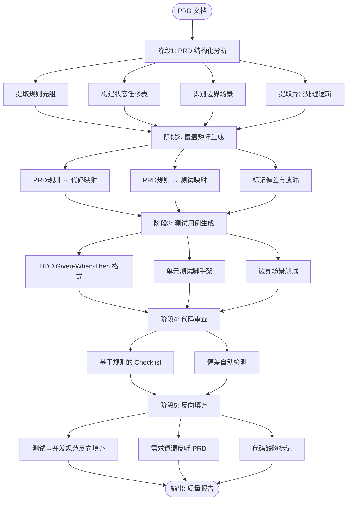
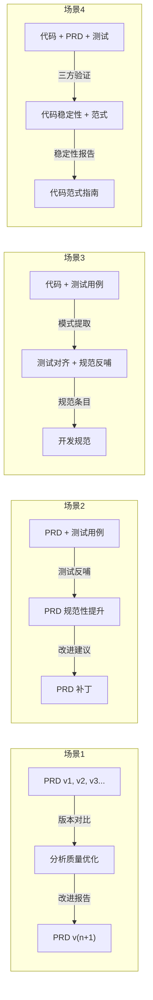

# Quality Engineering Loop（质量工程闭环）

**核心理念：PRD、代码、测试不是流水线，而是同一业务逻辑的三种正交视图。**

- **PRD**：业务逻辑的**语义**视图（What & Why）
- **代码**：业务逻辑的**实现**视图（How）
- **测试**：业务逻辑的**验证**视图（Correctness）

优化核心：**提取三方交集（核心规约）**，**自动/半自动标记差异（偏差与遗漏）**。

## 前后端职责划分

**每条规则/需求项都需明确归属：**

| 归属 | 职责范围 | 典型内容 |
|------|---------|---------|
| **前端 (FE)** | UI/交互/展示逻辑 | 组件渲染、状态联动、表单校验、路由跳转 |
| **后端 (BE)** | 数据/业务/调度 | 数据持久化、业务规则校验、定时调度、异常处理 |
| **协作 (FE+BE)** | 需要接口约定 | 状态同步、文件上传、数据校验、导出功能 |

**划分原则：**

1. **用户可见的交互** → 前端
2. **数据存储与持久化** → 后端
3. **业务规则校验** → 后端（前端可做预检）
4. **状态同步机制** → 协作项
5. **未知/待确认** → 标记为 UNKNOWN，需产品/技术确认

## 技能组架构

所有子技能均为**顶层独立 skill**，可单独调用，也可通过本入口串联使用。

```text
.kilocode/skills/
├── quality-engineering-loop/          # 组入口（本文件）
│   ├── SKILL.md                       # 闭环工作流 + 4场景映射
│   └── templates/                     # 端到端样例 + CI 配置模板
│       ├── .quality-loop.json
│       └── samples/
│           ├── sample-prd.md
│           ├── sample-analysis.md
│           ├── sample-matrix.md
│           ├── sample-test.ts
│           └── sample-dev-standard.md
│
├── prd-structured-analysis/           # 子技能1：PRD 结构化分析
├── coverage-matrix/                   # 子技能2：覆盖矩阵生成
├── test-generation/                   # 子技能3：测试用例生成（BDD）
├── code-review-checklist/             # 子技能4：代码审查 Checklist
├── ci-integration/                    # 子技能5：CI 集成入口
├── prd-quality-improver/              # 子技能6：PRD 质量提升（场景1+2）
└── standards-backfill-engine/         # 子技能7：规范反向填充（场景3+4）
```

## 使用方式

### 手动触发（评审前）

```bash
# 1. PRD 结构化分析
/prd-structured-analysis <prd-file.md>

# 2. 生成覆盖矩阵
/coverage-matrix <analysis-output>

# 3. 生成测试用例
/test-generation <analysis-output>

# 4. 生成代码审查清单
/code-review-checklist <analysis-output>

# 5. PRD 质量评估与改进
/prd-quality-improver <prd-file> <test-dir>

# 6. 开发规范反向填充
/standards-backfill-engine <code-dir> <test-dir>
```

### 前后端职责划分模式

```bash
# 分析 PRD 并划分前后端职责
/prd-structured-analysis <prd-file.md> --fe-be-split

# 生成前后端分离的覆盖矩阵
/coverage-matrix <analysis-output> --fe-be-split

# 生成前端测试用例
/test-generation <analysis-output> --scope frontend

# 生成后端测试用例
/test-generation <analysis-output> --scope backend

# 生成前后端联调测试用例
/test-generation <analysis-output> --scope integration

# 代码审查（指定代码目录，自动匹配 FE/BE）
/code-review-checklist <analysis-output> --code-paths src/frontend,src/backend
```

### 按场景使用（4 种输入组合）

```bash
# 场景1: 不同版本 PRD → 分析质量优化
/prd-quality-improver --versions v1,v2,v3 --compare

# 场景2: PRD + 测试用例 → PRD 规范性提升
/prd-quality-improver --prd <prd-file> --tests <test-dir>

# 场景3: 代码 + 测试用例 → 测试对齐 + 规范反哺
/standards-backfill-engine --code <src-dir> --tests <test-dir>

# 场景4: 代码 + PRD + 测试 → 代码稳定性评估
/standards-backfill-engine --code <src-dir> --prd <prd-file> --tests <test-dir>

# 场景5: 前后端职责划分（新增）
/quality-engineering-loop <prd-file.md> --fe-be-split --fe-paths src/frontend --be-paths src/backend
```

### CI 集成（PRD 变更时）

```bash
# 自动触发分析流程
/ci-integration --trigger prd-change --path <prd-dir>
```

### 完整闭环（推荐）

```bash
# 一键执行全流程
/quality-engineering-loop <prd-file.md>
```

## 执行环境规范

### 1. 环境感知

每次执行分析前，**必须先检测并记录当前环境信息**：

| 环境项 | 检测方式 | 记录内容 |
| --- | --- | --- |
| 操作系统 | `uname -s` / `echo %OS%` | Windows / macOS / Linux |
| 项目根目录 | 当前工作目录或 git 根目录 | 绝对路径 |
| 执行时间 | 系统时间 | `YYYYMMDD-HHMMSS` 格式 |
| Shell 类型 | `$SHELL` / `$ComSpec` | bash / zsh / cmd / powershell |
| 可用工具链 | `node -v`, `python -v` 等 | 版本号 |

环境信息保存为 `.env.json`，放在临时工作目录根。

### 2. 临时工作目录

**所有中间产物必须在临时目录中生成**，不污染项目源码和 skill 目录。

**临时目录命名规则：**

```text
<项目根目录>/.temp/quality-loop-<YYYYMMDD-HHMMSS>/
```

**临时目录结构：**

```text
quality-loop-<timestamp>/
├── .env.json              # 环境信息（必生成）
├── analysis/              # 阶段1：PRD 结构化分析中间结果
├── matrix/                # 阶段2：覆盖矩阵中间数据
├── tests/                 # 阶段3：测试用例草稿
├── review/                # 阶段4：代码审查草稿
└── backfill/              # 阶段5：反向填充草稿
```

**临时目录生命周期：**

```text
开始分析 → 创建临时目录 → 写入 .env.json → 各阶段中间产物写入 → 最终输出物转移到项目目录 → 删除整个临时目录
```

### 3. 最终输出物保存位置

最终输出物**不保存在 skill 目录中**，而是保存到项目目录下的约定路径：

| 输出物类型 | 保存路径 | 说明 |
| --- | --- | --- |
| 结构化分析报告 | `docs/quality-loop/<YYYYMMDD>/analysis.md` | PRD 分析结果 |
| 覆盖矩阵 | `docs/quality-loop/<YYYYMMDD>/matrix.md` | 三维覆盖矩阵 |
| BDD 测试用例 | `tests/quality-loop/<模块名>/` | 测试文件 |
| 代码审查 Checklist | `docs/quality-loop/<YYYYMMDD>/checklist.md` | 审查清单 |
| 开发规范补充 | `docs/quality-loop/<YYYYMMDD>/dev-standard.md` | 规范条目 |
| 质量报告（综合） | `docs/quality-loop/<YYYYMMDD>/report.md` | 汇总报告 |

> 如果项目已有 `docs/` 目录，直接使用；如果没有，在输出时创建。

### 4. 清理规范

任务结束后**必须执行清理**：

1. 将最终输出物从临时目录**复制/移动**到项目目录对应路径
2. **删除整个 `.temp/quality-loop-<timestamp>/` 目录**
3. 输出清理确认日志：

```text
[Quality Loop] 任务完成
  ✓ 最终输出已保存至: docs/quality-loop/20260709/
  ✓ 临时目录已清理: .temp/quality-loop-20260709-143022/
  ✓ 输出文件: analysis.md, matrix.md, checklist.md
```

### 5. 异常处理

- 如果分析过程中**中断或失败**，临时目录**保留**（不清理），便于排查问题
- 在临时目录中保留 `.status.json` 记录执行状态（running / success / failed）
- 下次执行时，如发现残留的 `.status.json` 且状态为 `running`，提示用户是否清理

## 闭环工作流

### 基础流水线（单向）



### 4 种场景输入组合



### 场景→子技能映射

| 场景               | 输入              | 核心子技能                  | 辅助子技能                | 输出                     |
| ------------------ | ----------------- | --------------------------- | ------------------------- | ------------------------ |
| 1. PRD版本迭代     | PRD v1,v2,...     | `prd-quality-improver`      | `prd-structured-analysis` | 版本 diff + 趋势报告     |
| 2. PRD+测试        | PRD + 测试        | `prd-quality-improver`      | `coverage-matrix`         | PRD 质量评分 + 改进建议  |
| 3. 代码+测试       | 代码 + 测试       | `standards-backfill-engine` | `test-generation`         | 规范条目 + 覆盖矩阵更新  |
| 4. 三方综合        | 代码+PRD+测试     | `standards-backfill-engine` | 全部子技能                | 稳定性评估 + 范式建议    |

## 三种核心提取模式

### 模式1：规则元组（适用于计算类/规则类需求）

从 PRD 中提取最小规则单元：

```markdown
## 规则提取

| 规则ID | 规则描述 | 类型 | 约束 | 优先级 |
|--------|---------|------|------|--------|
| R001 | 实付 = 总额 - 优惠 + 运费 | 计算公式 | 无 | P0 |
| R002 | 运费 = f(地址) | 函数映射 | 地址非空 | P0 |
| R003 | 实付 >= 0 | 边界约束 | 强制 | P0 |
| R004 | 地址为空 → 默认运费 | 异常降级 | 必须 | P1 |
```

### 模式2：状态迁移表（适用于状态机/流转类需求）

```markdown
## 状态迁移表

| 当前状态 | 触发动作 | 目标状态 | 条件 | 非法? |
|---------|---------|---------|------|-------|
| 待支付 | 支付成功 | 已支付 | 金额匹配 | 否 |
| 待支付 | 超时30min | 已取消 | 自动 | 否 |
| 已支付 | 取消 | ❌ 非法 | — | 是 |
| 已取消 | 支付 | ❌ 非法 | — | 是 |
```

### 模式3：隐性规则显性化（适用于查询/列表类需求）

```markdown
## 隐性规则提取

| 显性描述 | 隐性规则 | 验证方式 | 风险等级 |
|---------|---------|---------|---------|
| 默认按时间倒序 | 必须有索引 | EXPLAIN 验证 | 高 |
| 仅展示最近3个月 | 需要分页上限 | LIMIT 检查 | 中 |
| 用户查看订单列表 | 权限隔离 | 数据权限测试 | 高 |
```

## 输出物清单

| 输出物 | 格式 | 用途 | 消费方 |
|--------|------|------|--------|
| 结构化分析报告 | JSON/Markdown | 需求评审、代码审查 | 产品、开发、测试 |
| 覆盖矩阵 | Markdown 表格 | 偏差检测、遗漏标记 | 开发、测试 |
| BDD 测试用例 | TypeScript/Markdown | 单元测试生成 | 开发、测试 |
| 代码审查 Checklist | Markdown | PR 审查 | 开发 |
| 开发规范补充 | Markdown | 规范反哺 | 开发 |
| CI 分析摘要 | JSON | 自动流水线 | CI/CD |

## 子技能详解

### 1. PRD 结构化分析

**输入：** Markdown PRD 文件
**输出：** 结构化分析结果（规则元组/状态表/边界矩阵）
**详见：** [prd-structured-analysis/SKILL.md](../prd-structured-analysis/SKILL.md)

### 2. 覆盖矩阵生成

**输入：** PRD 分析结果 + 代码 diff + 测试用例
**输出：** PRD-代码-测试 三维覆盖矩阵
**详见：** [coverage-matrix/SKILL.md](../coverage-matrix/SKILL.md)

### 3. 测试用例生成

**输入：** PRD 分析结果中的规则/边界/异常
**输出：** BDD 格式测试用例 + 单元测试脚手架
**详见：** [test-generation/SKILL.md](../test-generation/SKILL.md)

### 4. 代码审查 Checklist

**输入：** PRD 分析结果
**输出：** 基于规则的审查清单
**详见：** [code-review-checklist/SKILL.md](../code-review-checklist/SKILL.md)

### 5. CI 集成入口

**触发：** PRD 文件变更 / 代码提交 / 测试提交
**输出：** 自动化分析报告 + PR 评论
**详见：** [ci-integration/SKILL.md](../ci-integration/SKILL.md)

### 6. PRD 质量提升引擎（场景1+2）

**输入：** 不同版本 PRD / PRD + 测试用例
**输出：** PRD 版本对比报告 / PRD 质量评估 + 改进建议
**覆盖场景：**
- 场景1: 不同版本 PRD → 分析质量优化（版本 diff + 趋势追踪）
- 场景2: PRD + 测试用例 → PRD 规范性提升（6维质量评估 + 改进建议）
**详见：** [prd-quality-improver/SKILL.md](../prd-quality-improver/SKILL.md)

### 7. 开发规范反向填充引擎（场景3+4）

**输入：** 代码 + 测试用例 / 代码 + PRD + 测试
**输出：** 开发规范条目 / 代码稳定性评估 + 范式建议
**覆盖场景：**
- 场景3: 代码 + 测试 → 测试对齐 + 反向填充开发规范（模式提取 + 规范生成）
- 场景4: 代码 + PRD + 测试 → 代码稳定性评估（6维稳定性评分 + 范式建议）
**详见：** [standards-backfill-engine/SKILL.md](../standards-backfill-engine/SKILL.md)

## 样例文档

完整的端到端样例见 `templates/samples/` 目录：

| 文件 | 内容 |
|------|------|
| [sample-prd.md](templates/samples/sample-prd.md) | 样例 PRD 输入（订单金额计算） |
| [sample-analysis.md](templates/samples/sample-analysis.md) | 结构化分析输出 |
| [sample-matrix.md](templates/samples/sample-matrix.md) | 覆盖矩阵 |
| [sample-test.ts](templates/samples/sample-test.ts) | BDD 单元测试 |
| [sample-dev-standard.md](templates/samples/sample-dev-standard.md) | 反向填充的开发规范 |

## 与其他 Skill 的关系

| Skill | 关系 | 说明 |
|-------|------|------|
| `workflow-principles-group` | 互补 | 该 skill 管理开发流程，本 skill 管理质量闭环 |
| `jest-test-generator` | 下游 | 本 skill 输出可驱动 jest-test-generator |
| `analyze-and-split-requirements` | 上游 | 需求拆分后进入本 skill 的分析流程 |
| `gulp-command-helper` | 工具 | CI 集成可结合 gulp 命令 |

## 质量度量指标

| 指标 | 计算方式 | 目标值 |
|------|---------|--------|
| 规则覆盖率 | 已覆盖规则数 / 总规则数 | ≥ 95% |
| 测试对齐率 | PRD规则-测试映射数 / 总规则数 | ≥ 90% |
| 偏差发现率 | 自动发现的偏差 / 总偏差 | ≥ 80% |
| 反哺填充率 | 测试→规范条目数 / 测试发现的规范缺口 | ≥ 70% |
| PRD 缺陷率 | PRD 相关 Bug / 总 Bug | ≤ 20% |
