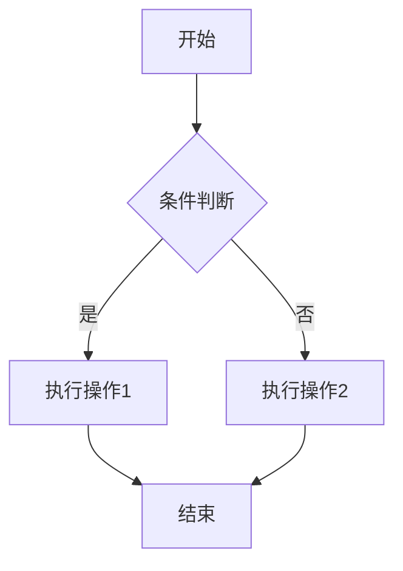
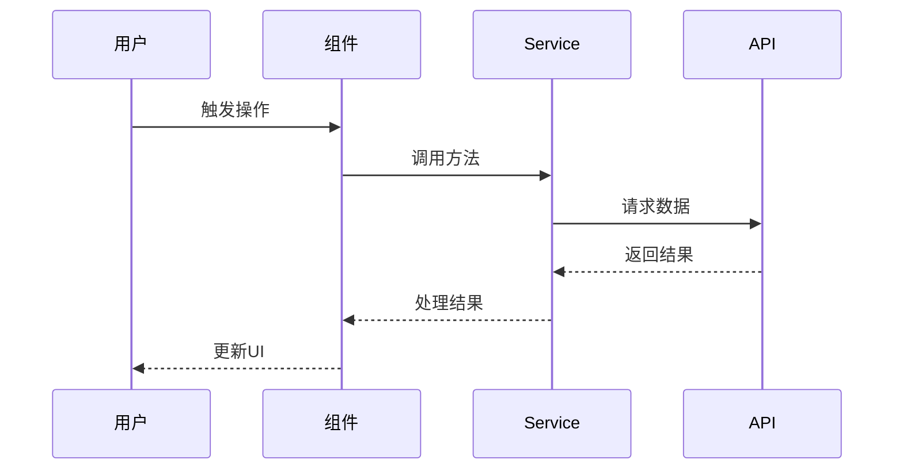

# 报告生成详细指南

本文档提供报告生成的详细操作指南和最佳实践。

## 快速开始

### 1. 选择报告模板

根据报告类型选择合适的模板：
- **技术分析报告**: 代码审查、重构总结、问题诊断
- **项目进度报告**: 任务完成、阶段性总结
- **性能分析报告**: 性能优化、瓶颈分析

### 2. 填充必要信息

每个模板都有明确的占位符，替换为实际内容：
- `[报告标题]` → 具体的报告标题
- `YYYY-MM-DD` → 实际日期
- `[姓名]` → 相关人员姓名

### 3. 添加具体内容

按照模板结构，逐章节填充内容。

---

## 技术分析报告 - 详细指南

### 执行摘要部分

**必须包含的要素**:
```markdown
## 📊 执行摘要

**执行时间**: 2026-04-16  
**执行状态**: ✅ 完成  
**总耗时**: 2 小时 30 分钟  
**影响范围**: 
- `file1.ts`
- `file2.ts`
- `hook1.ts`
```

**写作要点**:
- 简洁明了，控制在 50-100 字
- 突出关键成果和数据
- 使用状态标识（✅/⚠️/❌）

---

### 问题发现部分

**高优先级问题格式**:
```markdown
#### 1. 使用了 any 类型，失去类型安全检查
**位置**: `src/services/user.ts:45:15`  
**严重程度**: 🔴 高  
**规则**: `no-any`  

**当前代码**:
```typescript
const userData: any = await fetchUser()
```

**建议修复**:
```typescript
interface UserData {
  id: string
  name: string
  email: string
}
const userData = await fetchUser<UserData>()
```

**影响**: 可能导致运行时类型错误，降低代码可维护性
```

**注意事项**:
- 每个问题必须有明确的位置标注
- 提供修复前后的代码对比
- 说明问题的具体影响

---

### 改进成果部分

**数据表格格式**:
```markdown
### 代码质量指标

| 指标 | 改进前 | 改进后 | 提升 |
|------|--------|--------|------|
| TypeScript 错误数 | 15 | 0 | -100% |
| ESLint 警告数 | 23 | 5 | -78% |
| 代码行数 | 1200 | 950 | -21% |
| 圈复杂度 | 8.5 | 5.2 | -39% |
```

**具体收益列表**:
```markdown
### 具体收益
- ✅ 消除了所有 any 类型使用
- ✅ 提升了类型安全性
- ✅ 改善了代码可读性
- ✅ 减少了 21% 的代码量
```

---

### 技术方案部分

**方案对比表格**:
```markdown
### 方案对比

| 方案 | 优点 | 缺点 | 实施难度 | 推荐度 |
|------|------|------|----------|--------|
| 方案A: Service 层 | 职责清晰、易测试 | 需要重构现有代码 | 中 | ⭐⭐⭐⭐⭐ |
| 方案B: 保持现状 | 无需改动 | 难以维护 | 低 | ⭐⭐ |
| 方案C: Mixin | 代码复用 | 命名冲突风险 | 低 | ⭐⭐⭐ |
```

**最终选择说明**:
```markdown
### 最终选择
**选择**: 方案A - Service 层  
**理由**: 
1. 符合单一职责原则
2. 便于单元测试
3. 长期维护成本更低
4. 团队已有相关经验
```

---

## 项目进度报告 - 详细指南

### 完成的工作部分

**主要成果格式**:
```markdown
#### 1. Service 层重构
**描述**: 将业务逻辑从 Class 分离到独立的 Service 层  
**交付物**: 
- 📄 [CombinationService.ts](path/to/file)
- 📄 [ProjectService.ts](path/to/file)
- 📄 [重构完成报告](path/to/report.md)

**关键指标**:
- 代码行数: +362 / -414
- 文件数量: 3 个新文件
- 测试覆盖: 85%
```

**任务清单格式**:
```markdown
### 任务清单

- ✅ 创建 CombinationService (146行)
- ✅ 创建 ProjectService (199行)
- ✅ 重构 CombinationModule Class
- ✅ 更新 useCombinationModule Hook
- ✅ 完善 project-page.vue 组件
- ✅ TypeScript 编译验证通过
```

---

### 统计数据部分

**代码变更表格**:
```markdown
### 代码变更

| 类型 | 数量 | 说明 |
|------|------|------|
| 新建文件 | 3 | Service 层文件 |
| 修改文件 | 8 | Hooks 和 Components |
| 删除代码 | 414 行 | Class 中的业务逻辑 |
| 新增代码 | 362 行 | Service 层实现 |
| 净变化 | -52 行 | 代码更精简 |
```

---

### 目标达成情况

**目标跟踪表格**:
```markdown
| 目标 | 计划 | 实际 | 状态 |
|------|------|------|------|
| 创建 Service 层 | 3 个文件 | 3 个文件 | ✅ 达成 |
| 重构 Class | 3 个文件 | 3 个文件 | ✅ 达成 |
| 更新 Hooks | 3 个文件 | 3 个文件 | ✅ 达成 |
| TypeScript 验证 | 无错误 | 无错误 | ✅ 达成 |
| 编写文档 | 2 份 | 4 份 | ✅ 超额完成 |
```

---

## 性能分析报告 - 详细指南

### 性能瓶颈识别

**瓶颈描述格式**:
```markdown
### 瓶颈 1: 大列表渲染性能
**位置**: `home/components/table.vue:render`  
**严重程度**: 🔴 严重  
**当前性能**: 1200ms (1000条数据)  
**目标性能**: <200ms

**问题分析**:
当前使用 Element UI 的 el-table 组件渲染全部数据，
导致 DOM 节点过多，浏览器重排重绘开销大。

**优化方案**:
使用虚拟滚动技术，只渲染可视区域内的数据。
```

---

### 性能对比数据

**基准测试表格**:
```markdown
### 基准测试数据

| 测试场景 | 优化前 | 优化后 | 提升 |
|----------|--------|--------|------|
| 初始加载 (1000条) | 1200ms | 180ms | -85% |
| 滚动 FPS | 35 | 60 | +71% |
| 内存占用 | 85MB | 42MB | -51% |
| 首次绘制 | 800ms | 120ms | -85% |
```

**可视化对比**:
````markdown
### 渲染时间对比

```
优化前: ████████████████████ 1200ms
优化后: ███ 180ms (-85%)
```
````

---

### 优化措施详细说明

**措施格式**:
```markdown
### 措施 1: 引入虚拟滚动
**实施内容**:

替换前:
```vue
<el-table :data="largeList">
  <el-table-column prop="name" />
</el-table>
```

替换后:
```vue
<el-table-v2 
  :data="largeList"
  :height="600"
  :row-height="50"
>
  <template #default="{ rowData }">
    <div>{{ rowData.name }}</div>
  </template>
</el-table-v2>
```

**效果**:
- 渲染时间: 1200ms → 180ms (-85%)
- DOM 节点: 1000+ → ~20
- 内存占用: 85MB → 42MB (-51%)
```

---

## 高级技巧

### 1. 使用渐进式披露

对于复杂内容，使用 details/summary 折叠：

```markdown
<details>
<summary>查看详细技术细节</summary>

这里是详细的实现细节...

</details>
```

---

### 2. 使用 Mermaid 图表

**流程图**:
````markdown

````

**时序图**:
````markdown

````

---

### 3. 使用代码差异高亮

````markdown
```diff
 import { ref } from 'vue';
 
-const data: any = fetchData();
+interface UserData {
+  id: string;
+  name: string;
+}
+const data: UserData = fetchData<UserData>();
 
-function process(data: any) {
+function process(data: UserData): string {
   return data.name;
 }
```
````

---

### 4. 使用脚注

```markdown
这是一个重要的观点[^1]。

[^1]: 这是脚注的详细内容，可以包含更多解释和引用。
```

---

## 常见场景示例

### 场景 1: Code Review 报告

```markdown
# Code Review 报告 - user-list.vue

## 📊 执行摘要

**审查时间**: 2026-04-16  
**审查人**: Dev Advisor  
**文件**: `src/views/user-list/index.vue`  
**问题总数**: 5 (2高 2中 1低)

## 🔴 高优先级问题

### 1. 使用了 any 类型
[详细内容...]

### 2. 未清理事件监听器
[详细内容...]

## 💡 建议
[详细内容...]
```

---

### 场景 2: 重构总结报告

```markdown
# Class 到 Hook 重构总结

## 📊 执行摘要

**重构时间**: 2026-04-16  
**重构范围**: combination-reform 模块  
**涉及文件**: 12 个  
**状态**: ✅ 完成

## ✅ 完成的工作

### 1. Class 迁移
- CombinationModule → useCombinationModule
- ProjectData → useProjectData
- [更多详情...]

## 📈 改进成果
[详细内容...]
```

---

### 场景 3: 性能优化报告

```markdown
# 首页加载性能优化报告

## 📊 执行摘要

**优化时间**: 2026-04-16  
**优化目标**: 首屏加载时间 < 2s  
**当前状态**: 3.5s → 1.2s  
**提升**: -66%

## 🔍 瓶颈分析

### 瓶颈 1: 图片资源过大
[详细内容...]

## 🛠️ 优化措施
[详细内容...]
```

---

## 质量检查清单

在提交报告前，逐项检查：

### 内容完整性
- [ ] 执行摘要清晰完整
- [ ] 所有问题都有详细说明
- [ ] 提供了具体的解决方案
- [ ] 包含量化数据和指标
- [ ] 有明确的结论和建议

### 格式规范性
- [ ] 标题层级正确（H1→H2→H3→H4）
- [ ] 代码块有语言标识
- [ ] 表格格式对齐美观
- [ ] 列表符号统一
- [ ] 链接有效可访问

### 语言表达
- [ ] 术语使用一致
- [ ] 语句通顺流畅
- [ ] 无拼写错误
- [ ] 语气专业客观
- [ ] 段落长度适中

### 视觉效果
- [ ] 适当使用 emoji 增强可读性
- [ ] 关键信息加粗突出
- [ ] 有足够的空白分隔
- [ ] 颜色使用恰当（如需要）
- [ ] 整体布局清晰

---

## 工具推荐

### Markdown 编辑器
- **VS Code**: 内置 Markdown 预览
- **Typora**: 实时预览，所见即所得
- **Mark Text**: 开源免费

### 格式检查工具
```bash
# markdownlint - Markdown 格式检查
npm install -g markdownlint-cli
markdownlint reports/*.md

# prettier - 代码格式化
npx prettier --write reports/*.md
```

### 图表工具
- **Mermaid**: 文本生成图表
- **Draw.io**: 在线绘图工具
- **Excalidraw**: 手绘风格图表

---

**最后更新**: 2026-04-16  
**版本**: 1.0.0
