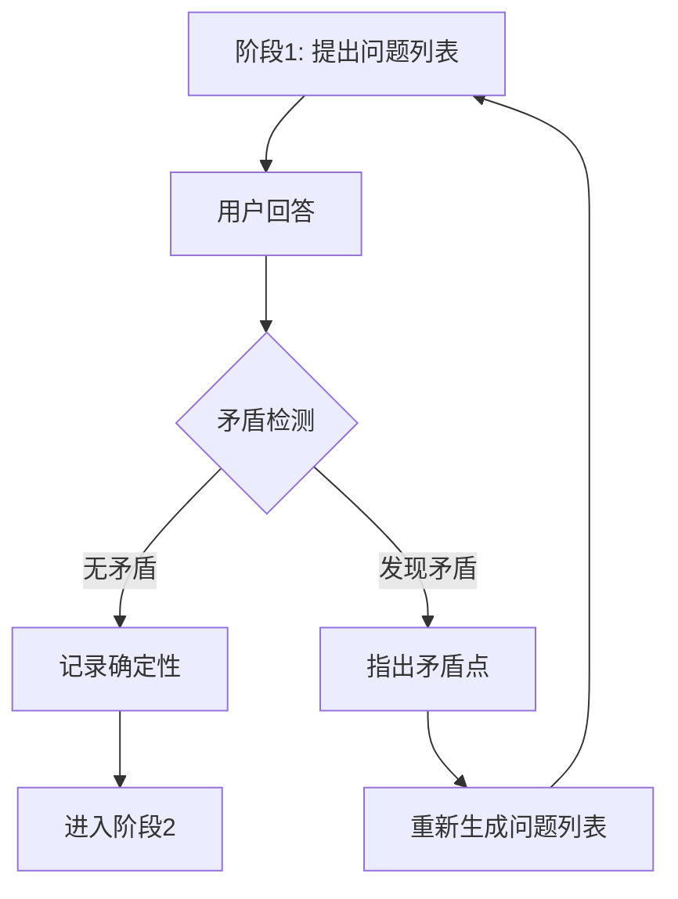

# 阶段1问题设计指南：苏格拉底提问法

## 核心理念

**使用苏格拉底提问法生成问题列表，发现需求中的核心矛盾和不足**

- **保持现有格式**：问题 + 选项A/B/C + 补充描述
- **提问法目的**：发现需求不足、暴露矛盾、引导思考
- **循环机制**：回答与需求冲突时，重复阶段1过程

## 苏格拉底提问法5个维度

在设计阶段1的问题列表时，从以下5个维度思考：

### 1. 澄清定义（Clarification）
**目的：明确需求中模糊的概念**

```markdown
❌ "性能要好" → 需要澄清
✅ "响应时间在100ms以内，支持1000并发用户"

问题模板：
- 你说的"XXX"具体是指什么？
- 能给出一个具体的例子吗？
- 这个概念包含哪些情况？不包含哪些情况？
```

**实例：**
```markdown
**问题1: [List.tsx:23](List.tsx#L23) "性能优化"的具体目标**

需求提到"优化列表性能"，这需要澄清：

- A. 首屏加载时间从2s优化到1s以内 - 明确性能指标
- B. 支持10000条数据流畅滚动 - 明确数据规模
- C. 减少内存占用50% - 明确资源目标
- D. 补充描述：**____**
```

### 2. 挑战假设（Challenging Assumptions）
**目的：发现需求中隐含的、未明确说明的假设**

```markdown
问题模板：
- 为什么必须是这种方式？有其他可能吗？
- 你假设XXX一定成立，如果这个假设不成立会怎样？
- 这个需求基于什么前提？这个前提一定正确吗？
```

**实例：**
```markdown
**问题2: [api.ts:45](api.ts#L45) 数据获取方式的假设**

代码中使用了全量加载，但需求未说明数据规模：

- A. 假设数据量小于100条，全量加载 - 小数据量假设
- B. 假设数据量在100-1000条，需要分页 - 中等数据量假设
- C. 假设数据量大于1000条，需要虚拟滚动 - 大数据量假设
- D. 补充描述：**____**

矛盾点：如果假设错误，需要重构整个数据加载逻辑。
```

### 3. 探究证据（Probing Evidence）
**目的：质疑需求是否有充分的理由**

```markdown
问题模板：
- 为什么需要这个功能？有数据支持吗？
- 这个需求的优先级是如何确定的？
- 如果不做这个功能会怎样？
```

**实例：**
```markdown
**问题3: [feature.ts:12](feature.ts#L12) 功能必要性的依据**

需求提到"添加导出Excel功能"：

- A. 用户频繁反馈需要批量导出数据 - 有明确用户需求
- B. 竞品都有此功能，我们需要跟进 - 竞品对标
- C. 运营部门需要定期生成报表 - 内部需求
- D. 补充描述：**____**

矛盾点：如果是为了报表需求，是否应该优先实现自动化报表生成？
```

### 4. 探索视角（Exploring Perspectives）
**目的：从不同角色和场景思考需求**

```markdown
问题模板：
- 不同用户群体对这个功能的需求一样吗？
- 在极端情况下这个需求还合理吗？
- 技术/产品/运营/用户的视角分别是什么？
```

**实例：**
```markdown
**问题4: [permission.ts:34](permission.ts#L34) 用户权限边界**

需求提到"管理员可以编辑内容"，但未明确权限边界：

- A. 超级管理员、普通管理员、内容编辑三级权限 - 细粒度权限
- B. 管理员拥有所有权限，普通用户只读 - 粗粒度权限
- C. 基于角色的动态权限配置 - 灵活权限系统
- D. 补充描述：**____**

矛盾点：如果后续需要权限变更，粗粒度设计需要重构。
```

### 5. 推演后果（Considering Consequences）
**目的：思考需求实现后的影响**

```markdown
问题模板：
- 如果这样实现，会有什么影响？
- 这个功能会影响现有功能吗？
- 未来扩展时会有什么限制？
```

**实例：**
```markdown
**问题5: [storage.ts:56](storage.ts#L56) 数据存储方案选择**

需求提到"保存用户设置"，但未明确存储方案：

- A. localStorage存储 - 简单但容量有限(5MB)，无法跨设备
- B. sessionStorage存储 - 会话级别，刷新页面仍存在，关闭标签页丢失
- C. 服务端存储 - 需要登录，可跨设备，但增加服务器压力
- D. 补充描述：**____**

矛盾点：如果用户需要跨设备同步，localStorage方案需要完全重构。
```

## 问题生成流程

### 第一步：需求分解

将需求拆解为关键功能点：

```markdown
需求：优化用户登录流程

分解：
1. 登录验证逻辑
2. 错误处理机制
3. 会话管理
4. 安全防护
5. 用户体验
```

### 第二步：苏格拉底式提问（5维度扫描）

对每个功能点，应用5个维度：

```markdown
功能点：错误处理机制

1. 澄清定义：需求提到"友好的错误提示"，具体指什么？
2. 挑战假设：错误提示一定需要友好吗？安全性与友好性的权衡？
3. 探究证据：为什么需要区分不同错误类型？有实际案例吗？
4. 探索视角：从安全角度，错误提示应该模糊；从用户体验角度，应该精确
5. 推演后果：如果错误提示太详细，可能被攻击者利用？
```

### 第三步：识别核心矛盾

从提问中提炼出关键矛盾：

```markdown
核心矛盾：
- 安全性 vs 用户体验（错误提示详细程度）
- 数据规模 vs 性能（加载策略）
- 灵活性 vs 复杂度（权限系统设计）
```

### 第四步：设计问题列表（保持现有格式）

```markdown
### ❓ 待确认疑问（批量提问）

**问题1: [auth.ts:45](auth.ts#L45) 错误提示详细度与安全性权衡**

需求提到"友好的错误提示"，但同时也强调"安全性优先"。

- A. 统一返回"用户名或密码错误" - 避免枚举攻击，安全性最高
- B. 区分返回"用户不存在"/"密码错误" - 用户体验好，但有安全风险
- C. 前三次详细提示，之后统一模糊提示 - 平衡安全与体验
- D. 补充描述：**____**
```

## 矛盾检测与循环提问

### 当用户回答后，检测是否产生新矛盾



### 矛盾检测标准

**需要重新提问的情况：**

1. **定义冲突**
   ```markdown
   Q: 用户规模预期？
   A: 选择B，预计100-1000用户

   新矛盾：但之前代码设计使用了单机架构，这个规模需要考虑集群部署
   → 重新提问：架构设计是否需要调整？
   ```

2. **假设失效**
   ```markdown
   Q: 数据加载方式？
   A: 选择A，全量加载

   新矛盾：前面确定数据规模在10000+条，全量加载会导致性能问题
   → 重新提问：是否需要改为分页加载？
   ```

3. **视角冲突**
   ```markdown
   Q: 权限粒度？
   A: 选择A，三级权限

   新矛盾：之前选择单机架构，细粒度权限会增加维护复杂度
   → 重新提问：是否需要简化权限或升级架构？
   ```

4. **后果矛盾**
   ```markdown
   Q: 存储方案？
   A: 选择A，localStorage

   新矛盾：前面确定需要跨设备同步，localStorage无法满足
   → 重新提问：是否需要改为服务端存储？
   ```

### 重新提问格式

```markdown
## ⚠️ 检测到矛盾

### 🔄 矛盾分析

**问题1回答：** 用户规模预计100-1000人
**问题2回答：** 选择单机架构部署

**矛盾点：** 100+用户同时使用，单机架构可能存在性能瓶颈。

**新问题：** 基于用户规模预期，是否需要调整为集群架构？

- A. 保持单机架构，通过垂直扩展（增加单机配置） - 成本低，维护简单
- B. 改为集群架构，支持水平扩展 - 高可用，但复杂度增加
- C. 先单机部署，预留集群扩展接口 - 折中方案
- D. 补充描述：**____**
```

## 完整示例

### 需求：优化用户登录流程

#### 阶段1问题列表（苏格拉底式设计）

```markdown
### 📊 复杂度评分

文件[3分] + 依赖[3分] + 需求[3分] + 技术[1分] + 业务[3分] = **总分 13/25**

### ❓ 待确认疑问（批量提问）

**问题1: [auth.ts:45](auth.ts#L45) 错误提示详细度与安全性**

需求提到"友好的错误提示"和"安全性优先"，这两者存在潜在冲突。

- A. 统一返回"用户名或密码错误" - 安全性最高，避免枚举攻击
- B. 区分返回"用户不存在"/"密码错误" - 用户体验好，但有安全风险
- C. 前三次失败详细提示，之后统一模糊提示 - 平衡安全与体验
- D. 补充描述：**____**

**问题2: [session.ts:23](session.ts#L23) 会话管理策略**

需求未明确会话过期时间和并发登录策略。

- A. 会话7天有效，允许单设备登录 - 安全优先，适合敏感系统
- B. 会话30天有效，允许多设备登录 - 用户体验优先
- C. 会话永久，手动登出才失效 - 简化实现，适合低风险场景
- D. 补充描述：**____**

**问题3: [rateLimit.ts:12](rateLimit.ts#L12) 登录失败处理**

需求提到"防止暴力破解"，但未明确限流策略。

- A. IP级别限流：同一IP 5分钟内最多尝试5次 - 防止单IP攻击
- B. 账号级别限流：同一账号 5分钟内最多尝试5次 - 防止定向破解
- C. 双重限流：IP + 账号双重限制 - 最安全，但实现复杂
- D. 补充描述：**____**

**问题4: [log.ts:34](log.ts#L34) 登录日志记录范围**

需求未明确日志记录粒度。

- A. 仅记录失败日志 - 专注异常，节省存储
- B. 记录所有登录尝试 - 完整审计，存储压力大
- C. 记录失败日志 + 成功日志摘要 - 平衡审计与存储
- D. 补充描述：**____**

**问题5: [ui.tsx:56](ui.tsx#L56) 登录页面交互细节**

需求提到"优化用户体验"，但未明确具体优化点。

- A. 添加记住密码功能 - 减少用户输入
- B. 添加第三方登录（微信/Google） - 简化登录流程
- C. 优化加载动画和错误提示样式 - 提升视觉体验
- D. 补充描述：**____**

### 📌 补充说明

需求未提及但实现需明确的细节：

1. **[crypto.ts:23](crypto.ts#L23) 密码加密方式** - 使用bcrypt，salt rounds=10（行业标准）
2. **[validate.ts:45](validate.ts#L45) 密码强度规则** - 至少8位，包含大小写字母和数字（安全最佳实践）

### ⏸️ 等待确认

请在以上问题中选择方案或补充描述。回复格式：
```copy
问题1: 选择A
问题2: 选择B
问题3: 补充描述：需要支持企业内网IP白名单
问题4: 选择C
问题5: 选择A
补充说明: [如有异议请说明]
```
```

#### 用户回答后矛盾检测示例

**用户回答：**
```
问题1: 选择B - 区分错误类型
问题2: 选择C - 会话永久有效
问题3: 选择A - IP级别限流
问题4: 选择B - 记录所有日志
问题5: 选择B - 第三方登录
```

**矛盾检测：**

```markdown
## ⚠️ 检测到矛盾

### 🔄 矛盾分析

**矛盾1：安全性冲突**
- 问题1选择B：区分错误类型（安全性降低）
- 问题3选择A：IP限流（防止外部攻击）
- 矛盾点：区分错误类型可能被攻击者利用枚举用户名，IP限流无法防止已注册用户的定向攻击

**矛盾2：会话管理与第三方登录冲突**
- 问题2选择C：会话永久有效
- 问题5选择B：第三方登录
- 矛盾点：第三方登录通常有自己的token过期机制，永久会话可能存在安全风险

### 🔄 重新提问

**新问题1: 登录安全策略整体方案**

考虑到您选择区分错误类型和第三方登录，需要重新明确整体安全策略：

- A. 高安全性方案：统一模糊错误提示 + 短期会话 + 双重限流 - 适合金融/医疗场景
- B. 平衡方案：区分错误类型 + 中期会话 + 账号限流 + 异常监控 - 适合一般业务场景
- C. 用户体验优先：详细错误提示 + 长期会话 + 宽松限流 - 适合低风险场景
- D. 补充描述：**____**

**新问题2: 第三方登录集成范围**

您选择添加第三方登录，需要明确具体平台：

- A. 仅微信登录 - 覆盖国内用户
- B. 微信 + Google - 覆盖国内外用户
- C. 微信 + Google + GitHub - 面向开发者群体
- D. 补充描述：**____**

请重新选择或补充说明。
```

## 关键原则总结

### 1. 问题设计原则

**五个维度思考：**
- 澄清定义：明确模糊概念
- 挑战假设：发现隐含假设
- 探究证据：质疑需求依据
- 探索视角：多角度思考
- 推演后果：考虑长期影响

### 2. 矛盾检测原则

**四个标准：**
- 定义冲突：回答与已有需求矛盾
- 假设失效：回答使某个假设不成立
- 视角冲突：不同视角的回答冲突
- 后果矛盾：回答导致新的问题

### 3. 循环提问原则

**触发条件：**
- 用户回答产生新矛盾
- 用户补充改变了需求理解
- 用户选择暴露了新的不确定性

**循环流程：**
```
提出问题 → 用户回答 → 矛盾检测 → 发现矛盾 → 重新提问 → ... → 无矛盾 → 进入阶段2
```

## 实施检查清单

**设计问题时：**
- [ ] 是否应用了5个维度的思考？
- [ ] 是否发现了核心矛盾？
- [ ] 选项是否覆盖了主要可能性？
- [ ] 是否引导用户思考而非简单选择？

**检测矛盾时：**
- [ ] 是否交叉验证了不同问题的答案？
- [ ] 是否检查了与已有需求的冲突？
- [ ] 是否推演了回答的后果？
- [ ] 是否发现了新的不确定性？

**重新提问时：**
- [ ] 是否明确指出了矛盾点？
- [ ] 是否提供了新的选项？
- [ ] 是否减少了选项数量（聚焦矛盾）？
- [ ] 是否保持了苏格拉底式提问风格？