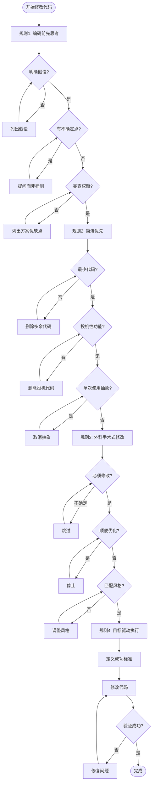

# 修改代码基础原则

**编写/修改代码时的 4 条核心指导原则。**

这些原则是代码质量的基石，**始终遵循**，即使是"快速改一下"或"简单修改"。

---

## 规则 1：编码前先思考 (Think Before Coding)

> **明确陈述假设；不确定的地方要提问而不是靠猜；暴露权衡，列出多种方案的优缺点；如果存在更简单的方法，要予以反驳。**

### 为什么重要？

- 防止基于错误假设编写代码
- 避免遗漏关键边界条件
- 确保选择了最合适的方案

### 如何执行？

**编码前检查清单：**

1. **明确陈述假设**
   - 我假设输入数据的格式是 X
   - 我假设这个函数只会在 Y 场景下调用
   - 我假设用户权限是 Z

2. **不确定的地方提问**
   - ❌ 猜测："大概是这样实现的..."
   - ✅ 提问："这个函数的调用时机是什么？"
   - ✅ 提问："边界条件如何处理？"

3. **暴露权衡**
   - 方案 A：简单但性能稍差
   - 方案 B：复杂但性能更好
   - **推荐方案 A，因为...**

4. **反驳复杂方案**
   - "如果存在更简单的方法..."
   - "为什么不用那个更简单的方案？"
   - "复杂方案真的必要吗？"

### 示例

**错误做法：**

```typescript
// 直接开始写，没有思考
function processData(data: any) {
  return data.map(item => transform(item));
}
```

**正确做法：**

```markdown
## 编码前思考

**假设：**
- 输入数据是数组格式
- 每个元素都有 transform 所需的字段
- 数据量在 1000 条以内

**不确定点：**
- ❓ 空数组如何处理？返回空数组还是报错？
- ❓ 数据量超过 1000 条时的性能表现？

**权衡：**
- 方案 A：直接处理，简单但可能内存溢出
- 方案 B：分批处理，复杂但安全
- **推荐方案 B**，数据量不确定时更安全
```

---

## 规则 2：简洁优先 (Simplicity First)

> **只写能解决问题的最少代码；不写投机性功能；不为单次使用的代码做抽象；如果资深工程师会觉得过度复杂——简化它。**

### 为什么重要？

- 减少维护成本
- 降低出错概率
- 提高代码可读性

### 如何执行？

**简洁检查清单：**

| 检查项 | 问自己 | 如果是 → |
|--------|--------|---------|
| **最少代码** | 这行代码解决问题了吗？ | 删除多余代码 |
| **投机性功能** | 这个功能用户现在需要吗？ | 删除或暂缓 |
| **单次使用** | 这段代码只用一次吗？ | 不要抽象 |
| **过度复杂** | 资深工程师会觉得复杂吗？ | 简化它 |

### 示例

**违反简洁原则：**

```typescript
// 投机性功能：用户没要求验证邮箱格式
function validateEmail(email: string): ValidationResult {
  const emailRegex = /^[^\s@]+@[^\s@]+\.[^\s@]+$/;
  const disposableDomains = ['tempmail.com', 'throwaway.com'];
  
  // 用户没要求的域名检查
  if (disposableDomains.includes(email.split('@')[1])) {
    return { valid: false, error: 'Disposable email not allowed' };
  }
  
  // 用户没要求的 MX 记录检查
  // ...更多代码...
  
  return emailRegex.test(email) 
    ? { valid: true }
    : { valid: false, error: 'Invalid format' };
}
```

**简洁版本：**

```typescript
// 只做用户要求的：验证邮箱格式
function validateEmail(email: string): boolean {
  const emailRegex = /^[^\s@]+@[^\s@]+\.[^\s@]+$/;
  return emailRegex.test(email);
}
```

**过度抽象示例：**

```typescript
// 单次使用，不需要抽象
class EmailValidatorFactory {
  createValidator(type: string): EmailValidator {
    // ...
  }
}

// 直接写函数即可
function validateEmail(email: string): boolean {
  return /^[^\s@]+@[^\s@]+\.[^\s@]+$/.test(email);
}
```

---

## 规则 3：外科手术式修改 (Surgical Changes)

> **只触碰必须修改的地方；不要顺便"优化"无关的代码、注释或格式；不重构没坏的东西；匹配现有风格。**

### 为什么重要？

- 减少 diff 噪音
- 降低引入 bug 的风险
- 保持代码审查焦点

### 如何执行？

**外科手术检查清单：**

| 检查项 | 问自己 | 如果是 → |
|--------|--------|---------|
| **必须修改** | 这行代码必须改吗？ | 跳过 |
| **顺便优化** | 我在顺便"优化"吗？ | 停止 |
| **重构没坏的** | 这段代码有问题吗？ | 不动 |
| **风格匹配** | 我的风格和现有代码一致吗？ | 调整 |

### 示例

**错误做法：**

```diff
// 原任务：修复登录验证 bug
function login(username: string, password: string) {
-  // 原有注释，有点啰嗦，顺便删掉
-  if (!username || !password) {
+  // 我重新写的注释，更清晰
+  if (!username || !password || username.length < 3) { // 顺便加长度检查
     return { error: 'Missing credentials' };
   }
-  // 顺便格式化一下
-  const user = db.findUser(username);
+    const user = db.findUser(username);  // 改了缩进
  
-  // 这个函数名不太好，顺便改一下
-  return validateUser(user, password);
+  return checkUser(user, password);  // 改了函数名
}
```

**正确做法：**

```diff
// 只修复登录验证 bug
function login(username: string, password: string) {
  if (!username || !password) {
     return { error: 'Missing credentials' };
   }
  
  const user = db.findUser(username);
-  return validateUser(user, password);  // bug: 密码验证逻辑错误
+  return validateUser(user, password, { strictMode: true });  // 修复：添加严格模式
}
```

---

## 规则 4：目标驱动执行 (Goal-Driven Execution)

> **定义成功标准并循环直到验证成功；不要告诉 Claude 执行步骤，而是定义"成功是什么样"，让它自己迭代；能用更少步骤达成就用更少步骤。**

### 为什么重要？

- 确保目标达成，而不是"看起来完成了"
- 减少"问一个→答一个→发现新问题→再问"的循环
- 允许 Claude 自主迭代，提高效率

### 如何执行？

**目标驱动检查清单：**

1. **定义成功标准**
   - "成功是：测试通过 + 功能可用 + 无 console 报错"
   - "成功是：用户可以完成 X 操作"

2. **循环验证**
   - 运行测试 → 失败 → 修复 → 再测试
   - 手动验证 → 失败 → 调整 → 再验证
   - **直到成功，不要中途停止**

3. **最少步骤**
   - "我需要 10 个步骤" → 问："能用 5 个吗？"
   - "先做 A，再做 B" → 问："能一步到位吗？"

### 示例

**错误做法：**

```markdown
用户："修复登录 bug"

AI："好的，我会：
1. 找到登录代码
2. 读取代码
3. 分析 bug
4. 修改代码
5. 保存文件"

AI 执行完步骤 5 后停止："我已经修改了代码。"

用户："还是报错..."

AI："哦，那我再检查..."
```

**正确做法：**

```markdown
用户："修复登录 bug"

AI："成功标准：用户可以正常登录，无报错。"

AI 修改代码 → 运行测试 → 测试失败 → 修复 → 再测试 → 通过 → 手动验证 → 成功

AI："登录 bug 已修复，验证通过。"
```

---

## 原则应用流程图



---

## 快速检查表

编码时，问自己这 4 个问题：

| 规则 | 问题 | 如果否 → |
|------|------|---------|
| **规则1** | 我思考过了吗？ | 先思考再编码 |
| **规则2** | 这是最简洁的吗？ | 删除多余代码 |
| **规则3** | 我只改了必须改的吗？ | 撤销顺便修改 |
| **规则4** | 成功标准达到了吗？ | 继续迭代 |

---

## 常见陷阱

1. **"这很简单"** → 简单也需要思考
2. **"顺便优化"** → 外科手术式修改
3. **"以后可能用到"** → 简洁优先，不写投机性功能
4. **"我已经改完了"** → 目标驱动，验证成功才算完成

---

记住：**每个原则解决实际问题**——错误假设、过度复杂、无关变更、未验证完成。遵循原则 = 提高成功率。